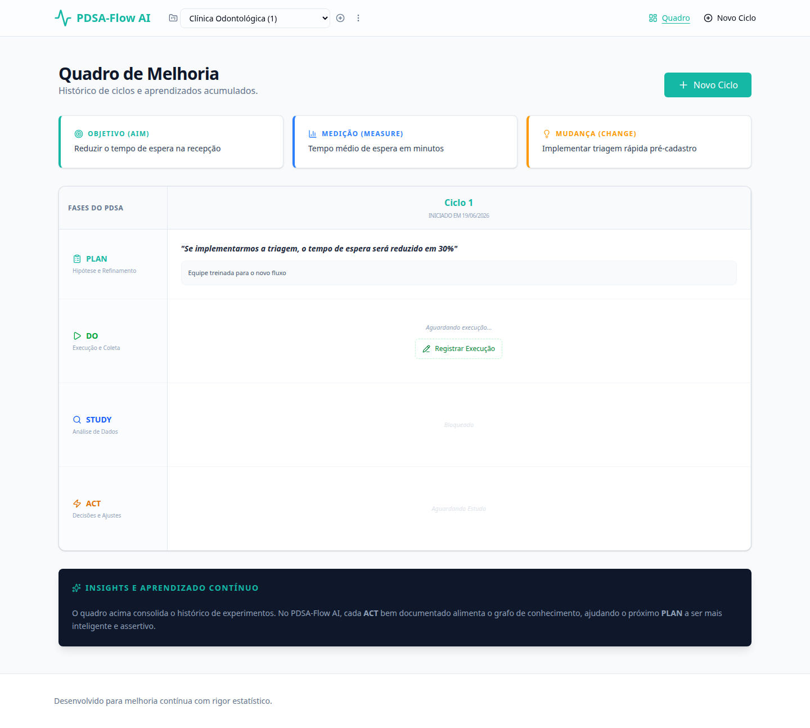
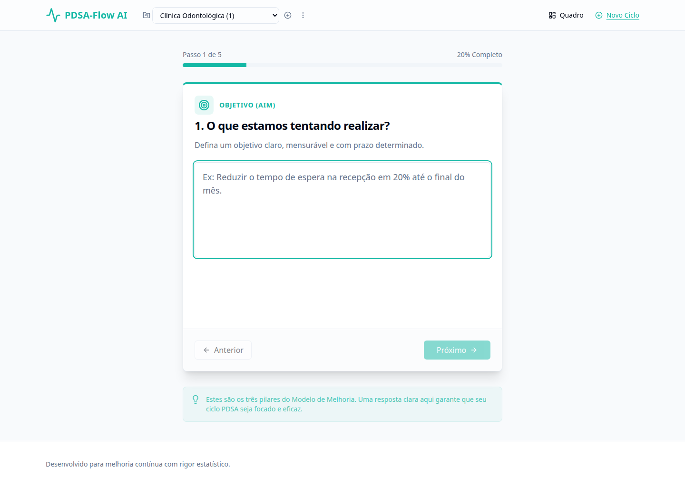
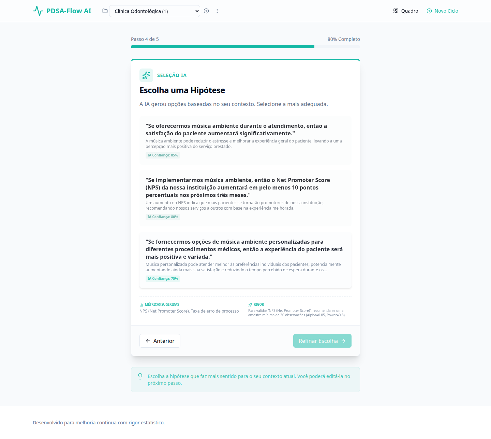

# 🔄 PDSA-Flow AI

> Framework web híbrido humano-IA para orquestração de ciclos de melhoria contínua (PDSA) com rigor estatístico e aprendizado via agentes LangGraph.

**Status:** 🚀 MVP Funcional v1.2  
**Domínio Piloto:** Clínicas médicas / Pequenos negócios de serviço  
**Princípio:** Human-in-the-loop + Rigor estatístico + Agentes inteligentes locais

---

## 🎯 Problema & Solução

**Problema:** Ferramentas de melhoria tradicionais não ajudam na geração de hipóteses; IAs comuns alucinam causalidade e não se adaptam ao contexto real.

**Solução:** Plataforma que automatiza o ciclo PDSA (Plan-Do-Study-Act), utiliza IA local (Ollama) para sugerir hipóteses e decisões com análise estatística, e garante que o especialista humano refine cada etapa antes da persistência.

---

## ✨ Funcionalidades Implementadas

### 📋 Gestão de Projetos
- Criação, renomeio e exclusão de projetos
- Ciclos PDSA organizados dentro de projetos
- Contagem de ciclos por projeto
- Isolamento total entre projetos

### 🧠 Wizard de Planejamento (PLAN)
- Formulário guiado com as 3 perguntas do Modelo de Melhoria (Aim, Measure, Change)
- Geração de **3 hipóteses** via IA local (Ollama)
- Análise de poder estatístico com tamanho amostral recomendado
- Refinamento humano: edição da hipótese selecionada e observações

### 🎯 Execução (DO)
- Registro de observações e dados coletados durante a execução

### 📊 Análise (STUDY)
- Análise automática via IA: compara plano vs. execução
- Classificação da hipótese como confirmada (yes), parcial (partial) ou rejeitada (no)

### 🚀 Decisão (ACT)
- Recomendação via IA: Adotar (adopt), Adaptar (adapt) ou Abandonar (abandon)
- Geração de próximos passos para o ciclo seguinte
- Possibilidade de editar a decisão e justificativa

### 🖥️ Quadro PDSA
- Visualização em timeline de todos os ciclos
- Diálogos modais para cada fase
- Indicador visual de progresso por ciclo
- Opções de reset de fase e exclusão de ciclo

---

## 🏗️ Stack

```text
Frontend:     React 19 + TypeScript + Vite + Tailwind CSS v4 + Framer Motion
Backend:      FastAPI (Python 3.12) + SQLAlchemy 2.0 (Async) + Alembic
IA Core:      LangGraph + LangChain + Ollama (granite4.1 / llama3.1)
Banco:        PostgreSQL 16 (Docker)
Infra:        Docker Compose + Makefile
```

---

## 📂 Estrutura

```
/
├── apps/
│   ├── api/                  # Backend FastAPI
│   │   ├── src/
│   │   │   ├── agents/       # Agentes LangGraph (Plan, Study, Act)
│   │   │   ├── api/          # Endpoints REST
│   │   │   ├── db/           # Sessão e base SQLAlchemy
│   │   │   ├── models/       # Modelos ORM (PDSACycle, Project)
│   │   │   └── schemas/      # Schemas Pydantic
│   │   └── alembic/          # Migrations
│   └── web/                  # Frontend React
│       └── src/
│           ├── components/   # Componentes (Wizard, Board, Dialogs)
│           │   └── ui/       # Design system (Button, Card, Dialog, etc.)
│           └── lib/          # Utilitários
├── docs/                     # Documentação
├── Makefile                  # Comandos: infra-up, run-api, run-web
└── docker-compose.yml        # PostgreSQL
```

---

## ⚙️ Como Rodar (Dev)

### Pré-requisitos
- Docker + Docker Compose
- Python 3.12+
- Node.js 20+
- [Ollama](https://ollama.ai) rodando com um modelo (ex: `granite4.1:8b`)

```bash
# 1. Subir PostgreSQL
make infra-up

# 2. Backend (porta 8001)
cd apps/api
python -m venv .venv && source .venv/bin/activate
pip install -r requirements.txt
# Configure .env com seu modelo Ollama
uvicorn app:app --port 8001

# 3. Frontend (porta 5173)
cd apps/web
npm install
npm run dev
```

Acesse: **http://localhost:5173**

---

## 🖼️ Screenshots

### Quadro PDSA

> Visão geral dos ciclos com as fases Plan, Do, Study e Act.



### Wizard — Passo 1 (Objetivo)

> Definição do Aim seguindo o Modelo de Melhoria.



### Wizard — Seleção de Hipóteses com IA

> A IA (Ollama) gera 3 hipóteses com base no contexto informado.



---

## 🧪 Exemplo de Fluxo

1. Crie um projeto (ex: "Clínica Odontológica")
2. Inicie um novo ciclo PDSA
3. Responda às 3 perguntas do Modelo de Melhoria
4. A IA gera 3 hipóteses — escolha e refine a melhor
5. Execute o plano e registre observações no DO
6. Peça para a IA analisar os resultados (STUDY)
7. Receba a recomendação de decisão (ACT)
8. O ciclo se completa e os aprendizados ficam registrados

---

## 🛣️ Próximos Passos (Roadmap)

- [ ] **Encadeamento automático de ciclos**: Act de um ciclo gerar novo Plan
- [ ] **Diálogos modais** para DO, Study e Act (já implementados no frontend, aguardando screenshots)
- [ ] **Gráficos SPC** (Statistical Process Control) no Study
- [ ] **Grafo de Conhecimento Causal** com Neo4j
- [ ] **Exportação** de relatórios em PDF/CSV
- [ ] **Autenticação** e multi-usuário
- [ ] **Modo escuro**

---

## 🧠 Agentes

| Agente | Função | Tecnologia |
|--------|--------|------------|
| `plan_agent` | Gera hipóteses e valida poder amostral | LangGraph + Ollama |
| `study_agent` | Analisa execução vs. plano | LangGraph + Ollama |
| `act_agent` | Recomenda Adotar/Adaptar/Abandonar | LangGraph + Ollama |

---

## 🤝 Contribuindo

1. Use o `Makefile` para gerenciar serviços
2. Commits Convencionais (`feat:`, `fix:`, `docs:`)
3. Interface em **Português (PT-BR)**
4. Issues e PRs são bem-vindos!

> ⚠️ **LGPD**: Este sistema pode lidar com dados sensíveis. Siga as diretrizes da LGPD ao manipular dados reais de pacientes.

---

## 📄 Licença

MIT
